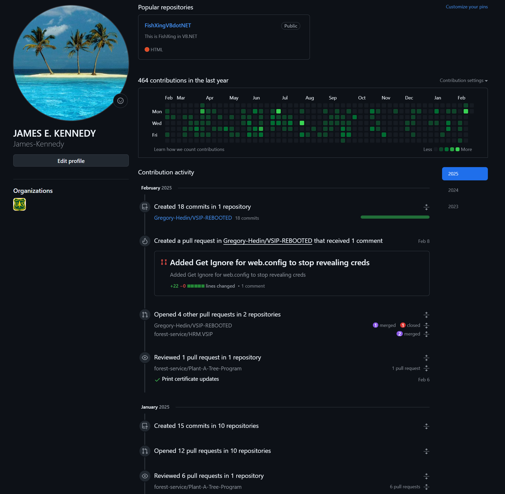
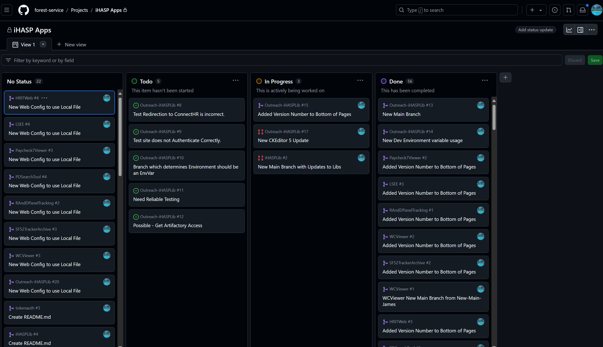

# James Kennedy's Resume for 2025!
Last Updated: 2025-02-15

## A Little About Me

I have 10+ years of full-stack software development and software engineering experience. 
I am open to any and all roles. 
I would like to be a Senior Software Engineer or a Software Program Manager.
My skillset is focused on .NET using C# for middleware and business logic, Entity (T-SQL) for the back end, and React (JavaScript) for the front end.

My professional work repo is attached to Forestry Service, this is one I use for my project, but most does not show my current work.

https://github.com/jekengineer/Resume2025

https://www.linkedin.com/in/james-kennedy-07958229b/

I love coding, programming, and tech in general. 
The process of thinking about how to make a great software is enjoyable. 
Acting on the plan in order to achieve something is part of what makes me a great software dev.

Retro legacy applications are my favorite to work on. 
Visual Basic, C++, anything ancient and using .NET I can work with! 
I've fought Oracle and migrated to PostgreSQL. 
I prefer Azure and MSSQL.
Component libraries are my best friends.

In my spare time I enjoy playing Mahjong.

